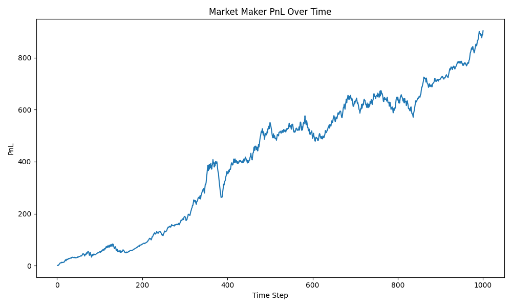
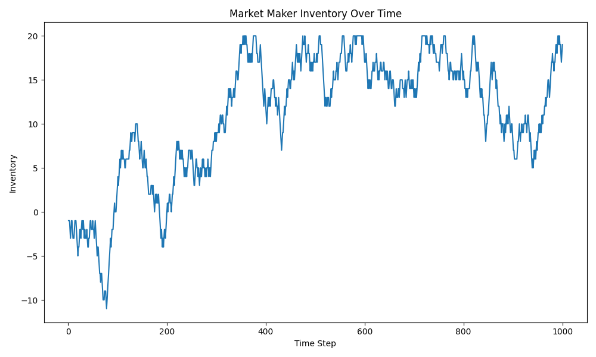
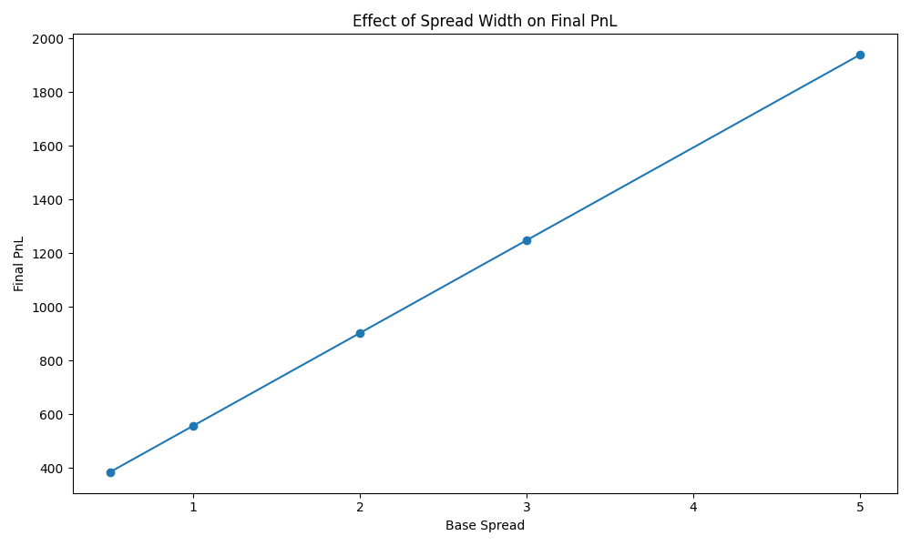

# Market-Making Simulator

## Project Overview

This project simulates a simple market maker who continuously quotes bid and ask prices, receives random customer orders, manages inventory risk, and tracks profit and loss over time.

The goal is to understand how market makers earn spread, how inventory risk affects pricing, and how different spread widths influence final PnL.

This project is designed as a quantitative finance preparation project, especially for quant trading roles.

---

## What is Market Making?

Market making means continuously providing prices at which other participants can buy or sell.

A market maker quotes two prices:

- **Bid price**: the price at which the market maker is willing to buy.
- **Ask price**: the price at which the market maker is willing to sell.

The difference between the ask and bid price is called the **spread**.

```text
Spread = Ask Price - Bid Price
```

Example:

```text
Fair value = 100
Bid = 99
Ask = 101
Spread = 2
```

If a customer sells to the market maker, the market maker buys at the bid price.
If a customer buys from the market maker, the market maker sells at the ask price.

By repeatedly buying at the bid and selling at the ask, the market maker earns the spread on average. The main risk is **inventory**: if order flow is one-sided, the maker builds up a large long or short position and is exposed to adverse moves in the fair value.

---

## How the Simulation Works

At every time step:

1. The true/fair value of the asset moves slightly (a random walk).
2. The trader estimates the fair value.
3. The trader quotes a bid and an ask price around it, skewed by current inventory.
4. A random customer may buy from the trader, sell to the trader, or do nothing.
5. Inventory changes.
6. Cash changes.
7. PnL is calculated (`cash + inventory x fair_value`).
8. Risk metrics are tracked.

To manage inventory risk, the trader **skews its quotes**: when holding a long position it lowers both quotes (encouraging sells, discouraging buys) to pull inventory back toward zero, and vice versa when short.

---

## Project Structure

```text
market-making-simulator/
|
|-- README.md
|-- requirements.txt
|-- .gitignore
|
|-- notebooks/
|   |-- market_making_analysis.ipynb
|
|-- src/
|   |-- __init__.py
|   |-- market.py           # Fair-value random walk and customer order generation
|   |-- trader.py           # Market-maker logic: quoting, execution, inventory, PnL
|   |-- risk.py             # Risk metrics: drawdown, volatility, Sharpe, summaries
|   |-- simulation.py       # Runs the full simulation loop and saves results
|   |-- visualisations.py   # Generates PnL, inventory, and spread-analysis charts
|
|-- results/
    |-- simulation_results.csv
    |-- pnl_chart.png
    |-- inventory_chart.png
    |-- spread_analysis.png
```

---

## Installation

```bash
git clone https://github.com/Sanskargade100/market-making-simulator.git
cd market-making-simulator
pip install -r requirements.txt
```

Dependencies: `numpy`, `pandas`, `matplotlib`, `jupyter`.

---

## Usage

Run the full simulation and save the results CSV:

```bash
PYTHONPATH=src python src/simulation.py
```

Generate the charts in `results/`:

```bash
PYTHONPATH=src python src/visualisations.py
```

Or open the notebook for the full narrated analysis:

```bash
jupyter notebook notebooks/market_making_analysis.ipynb
```

> On macOS, use `python3` in place of `python`.

---

## Key Parameters

| Parameter | Meaning |
| --- | --- |
| `initial_fair_value` | Starting value of the asset |
| `volatility` | How much the fair value randomly moves each step |
| `base_spread` | Basic bid-ask spread around the fair value |
| `order_probability` | Probability that a customer trades in a given step |
| `buy_probability` / `sell_probability` | Split of customer flow between buys and sells |
| `max_inventory` | Inventory limit before orders are refused |
| `inventory_penalty` | How strongly the trader skews quotes based on inventory |
| `trade_size` | Number of units traded per customer order |
| `num_steps` | Number of simulation time steps |

---

## Results

The PnL chart shows a steady upward drift as the spread is captured across many trades, with dips whenever the maker is caught holding inventory during an adverse move.



Inventory oscillates around zero thanks to the inventory-penalty skew, occasionally pressing against the `±max_inventory` cap.



The spread-sensitivity analysis illustrates the core trade-off: wider spreads earn more per trade but attract less volume, so final PnL is maximised somewhere in between.



---

## Risk Metrics

The simulator reports a set of summary metrics for each run:

- **final_pnl** — total mark-to-market profit at the end of the run
- **max_drawdown** — the largest peak-to-trough fall in PnL
- **pnl_volatility** — standard deviation of step-to-step PnL changes
- **sharpe_ratio** — average PnL change per unit of volatility (risk-adjusted return)
- **max_absolute_inventory** — the largest position held in either direction
- **number_of_trades** — total volume transacted

---

## Limitations

This is a deliberately simplified model. It assumes no competition, no adverse selection, random-walk prices, and perfect fills at the maker's quotes. Real market making involves competing for order flow, informed traders, volatility clustering and jumps, latency and queue position, and dynamically adapting parameters. Even so, the simulator captures the essential economics: **earn the spread, control inventory, and manage risk.**
